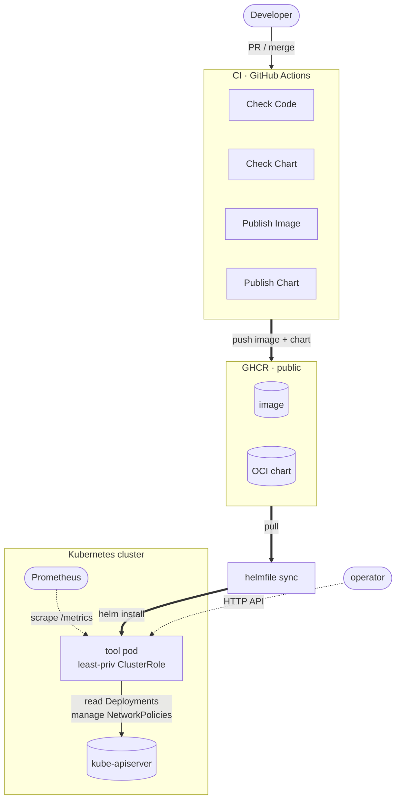

# tyk-sre-assignment

An HTTP tool over the Kubernetes API for three SRE tasks: report unhealthy Deployments,
isolate a workload's network on demand, and check API-server reachability. All commands
run through the `Makefile` (`make help`).

## Architecture



## Endpoints

| Method | Path | Purpose |
| --- | --- | --- |
| GET | `/healthz` | Liveness (no Kubernetes calls). |
| GET | `/readyz` | Readiness: live API-server probe; `503` when unreachable. |
| GET | `/deployments/unhealthy` | Deployments whose ready pods != desired. Optional `?namespace=`. |
| POST / DELETE | `/network-policies/isolate` | Apply / remove a default-deny NetworkPolicy for a workload. |
| GET | `/metrics` | Prometheus metrics (RED: request count + latency by route). |

Observability: RED metrics on `/metrics` (the chart adds `prometheus.io/scrape` annotations) and
structured JSON logs (`slog`) for lifecycle + errors , per-request telemetry lives in metrics, not logs.

## Develop

```bash
make test     # unit tests (fake clientset, race + coverage)
make build    # binary -> golang/bin
```

## Deploy

The whole deployment lives in `sample-deploy/` and pulls everything from remote registries, so
a third party with just this folder (no source checkout) can install it:

- `sample-deploy/helmfile.yaml` , the release: pulls the chart from `oci://ghcr.io/75asu/charts`
  and the image from `ghcr.io/75asu/tyk-sre-assignment` (the chart's default).
- `sample-deploy/{namespace,web-healthy,web-degraded}.yaml` , sample workloads used to exercise
  the tool (a namespace, a healthy Deployment, a broken one).

The chart (`helm/tyk-sre-assignment`) gives it a least-privilege ClusterRole (read
Deployments, manage NetworkPolicies), a hardened non-root Pod, and probes on `/healthz` +
`/readyz`. Deploy against any cluster with:

```bash
helmfile -f sample-deploy/helmfile.yaml sync
```

## Try it on kind

`make e2e` deploys against a throwaway kind cluster (pulling the chart + image from GHCR,
exactly as a third party would), seeds the workloads, and runs `make demo`, which curls every
endpoint and shows the tool creating then removing a NetworkPolicy.

```bash
make e2e        # kind up -> pull chart+image from GHCR -> seed -> demo (curl all endpoints)
make demo       # curl the endpoints + show the isolate/de-isolate NetworkPolicies
make kind-down  # clean up
```

> Note on isolation: the tool's job is to create/remove the correct default-deny
> NetworkPolicy on demand (the demo shows this). *Enforcing* it (dropping packets) is the
> CNI's job , Calico/Cilium enforce NetworkPolicies, kind's default (kindnet) accepts but
> does not. On a Calico/Cilium cluster this policy cuts traffic.

## CI

- **Check Code** , fmt / vet / build / unit tests (every PR).
- **Check Chart** , helm lint + kubeconform (every PR).
- **Publish Image** , builds on PRs; builds + pushes to GHCR on manual dispatch.
- **Publish Chart** , packages on PRs; pushes the OCI chart to GHCR on manual dispatch.

Deployment is verified by running `make e2e` against a local kind cluster (it pulls the
published chart + image, same as any third party would).
